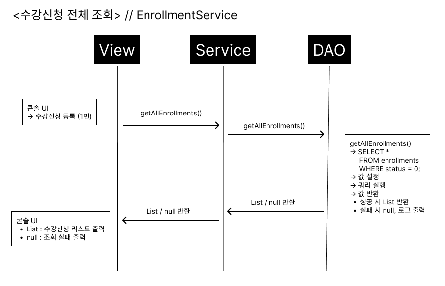
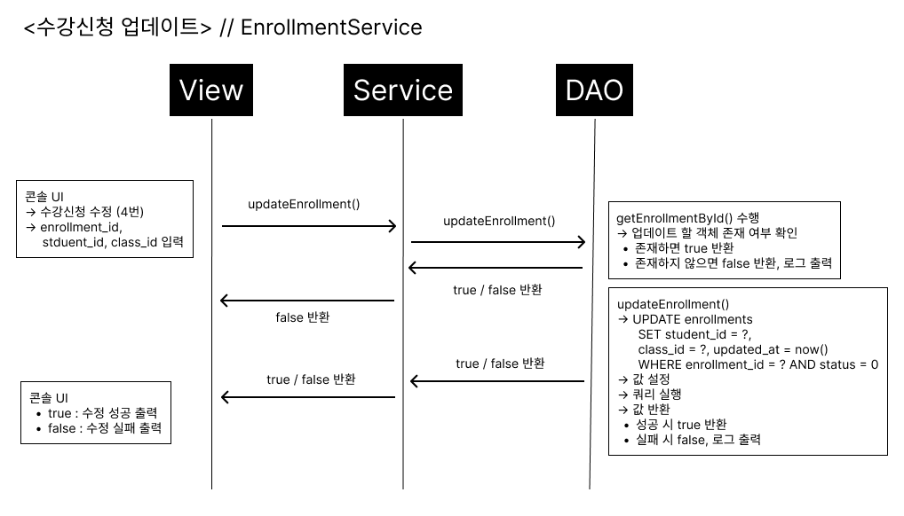
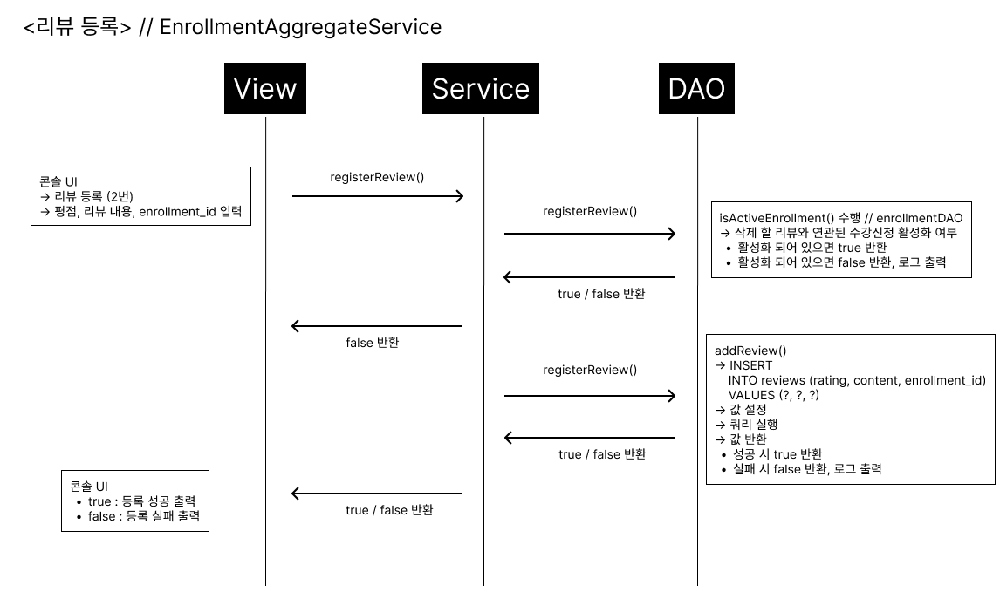

# 📘 메타벌스(metabirth)

> 소개 : 학원 전체 시스템을 시뮬레이션 하는 어플리케이션입니다.
> 맡은 부분 : 수강신청 -> 결제내역, 수강신청 -> 리뷰

---

## 🛠️ 기술 스택

- Java 17
- JDBC + HikariCP
- MySQL
- Gradle
- 기타: Logback

---

## ✅ 기능 요약

- [x] 수강신청 등록 + 결제 등록(원자성) / 조회 / 수정 / 삭제 (논리 삭제)
- - [x] 수강신청 삭제 시, 연관된 결제/리뷰 모두 삭제 처리 (논리 삭제)
- [x] 결제 등록(자동) / 조회 / 수정 / 삭제 (논리 삭제)
- - [x] 결제내역 삭제 시, 연관된 수강신청/리뷰 모두 삭제 처리 (논리 삭제)
- [x] 리뷰 등록 (수강신청이 활성 상태일 때만 가능) / 조회 / 수정 / 삭제 (논리 삭제)

---

## 📌 시퀀스 다이어그램

### 1. 수강신청 전체 조회

---

### 2. 수강신청 특정 조회

---

### 3. 수강신청 등록

---

### 4. 수강신청 업데이트

---

### 5. 수강신청 삭제 (연결된 결제/리뷰 논리 삭제 포함)

---

### 6. 리뷰 등록 (수강신청이 활성 상태일 때만 가능) // 결제내역도 동일한 흐름

---

## 🧩 주요 기능 정리

해당 애플리케이션은 관리자가 수강신청, 결제, 리뷰 내역을 직접 관리할 수 있도록 설계된 Java 기반 콘솔 프로그램입니다.  
모든 기능은 서비스 계층을 통해 DAO와 연동되며, 논리 삭제, 유효성 검증, 트랜잭션 처리 등을 통해 안정적인 데이터 관리를 제공합니다.

또한 수강신청이 생성되면 해당 ID는 status를 기준으로 관리되며, 다른 기능에서 활성화된 수강신청 ID(active_enrollment_id)로만 연산이 가능하도록 설계되어 있습니다.
이 active_enrollment_id는 결제와 리뷰 테이블에서 각각 **유니크 제약조건**으로 설정되어 있어, 활성 수강신청당 하나의 결제/리뷰만 생성될 수 있도록 보장합니다.

---

### 📌 1. 수강신청(Enrollment) 기능

- **수강신청 등록 + 결제 동시 등록**: 수강신청은 결제내역 등록과 동시에 트랜잭션으로 수행됩니다. 하나라도 실패할 경우 전체 작업이 롤백됩니다.
- **수강신청 전체 조회 / 단건 조회**: 등록된 모든 수강신청 정보 또는 특정 ID를 기준으로 조회할 수 있습니다.
- **수강신청 수정**: 수강신청 정보를 수정할 수 있으며, status가 활성인 경우에만 허용됩니다.
- **수강신청 삭제 (논리 삭제)**: status 값을 변경하여 비활성화 처리되며, 연결된 결제와 리뷰도 함께 논리 삭제됩니다. 하나라도 실패할 경우 전체 작업이 롤백됩니다.

---

### 💳 2. 결제(Payment) 기능

- **결제 등록 (자동)**: 수강신청 등록과 동시에 함께 등록됩니다.
- **결제 전체 조회 / 단건 조회**: 모든 결제 내역 또는 특정 ID를 기준으로 조회할 수 있습니다.
- **결제 수정**: 기존 결제의 수강신청 ID를 변경할 수 없으며, 등록된 결제 정보를 수정할 수 있습니다.
- **결제 삭제 (논리 삭제)**: status 값을 변경하여 비활성화 처리되며, 연결된 리뷰 및 수강신청도 함께 논리 삭제됩니다. 하나라도 실패할 경우 전체 작업이 롤백됩니다.

---

### 📝 3. 리뷰(Review) 기능

- **리뷰 등록**: 활성 상태의 수강신청 ID에 대해서만 등록할 수 있습니다. 비활성화된 수강신청 ID로는 등록이 차단됩니다.
- **리뷰 전체 조회 / 단건 조회**: 전체 리뷰 또는 특정 ID를 기준으로 조회할 수 있습니다.
- **리뷰 수정**: 리뷰 내용 수정은 가능하지만, 연결된 수강신청 ID는 변경할 수 없습니다.
- **리뷰 삭제 (논리 삭제)**: status 값을 변경하여 해당 리뷰를 논리적으로 삭제합니다.

---

