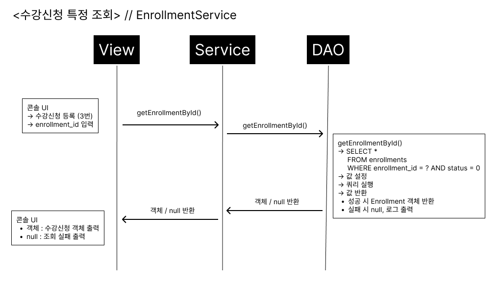
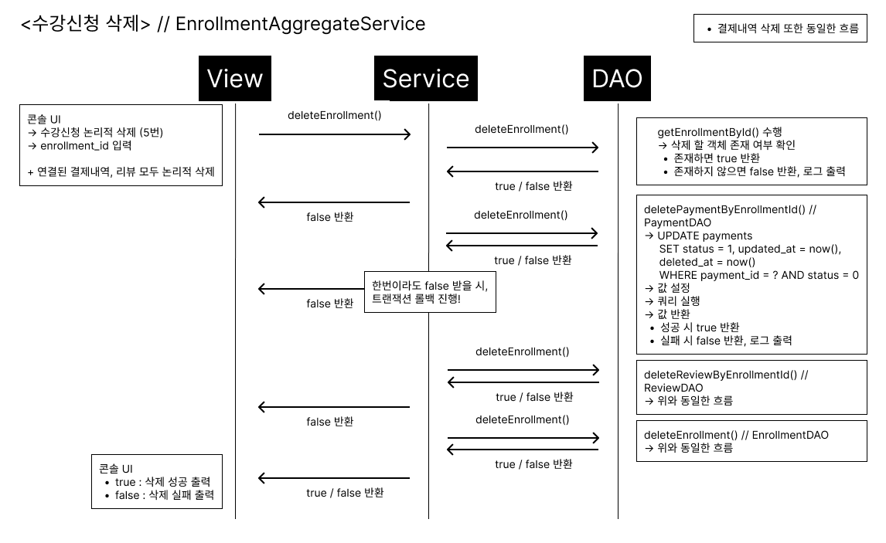

# 📘 메타벌스(metabirth)

> 소개 : 학원 전체 시스템을 시뮬레이션 하는 어플리케이션입니다.
> 맡은 부분 : 수강신청 -> 결제내역, 수강신청 -> 리뷰

---

## 🛠️ 기술 스택

- Java 17
- JDBC + HikariCP
- MySQL
- Gradle
- 기타: Logback

---

## 📁 프로젝트 구조

```
📦 src
 ┣ 📂 main
 ┃ ┣ 📂 java
 ┃ ┃ ┗ 📂 com.metabirth
 ┃ ┃ ┃ ┣ 📂 config     ← DB 연결 설정 클래스 (JDBCConnection)
 ┃ ┃ ┃ ┣ 📂 dao        ← DB 접근 (DAO 클래스)
 ┃ ┃ ┃ ┗ 📂 model      ← DTO / Entity 클래스
 ┃ ┃ ┃ ┣ 📂 service    ← 비즈니스 로직 (Service 클래스)
 ┃ ┃ ┃ ┣ 📂 uitl       ← 공통 유틸리티 클래스 (ex. QueryUtil)
 ┃ ┃ ┃ ┣ 📂 view       ← 사용자 입력/출력 (ex. EnrollmentView)
 ┃ ┗ 📂 resources
 ┃ ┃ ┣ 📄 config.properties  ← DB 접속 설정
 ┃ ┃ ┣ 📄 logback.xml        ← 로깅 설정 파일
 ┃ ┃ ┗ 📄 queries.xml        ← SQL 쿼리 모음
 ┗ 📂 test
   ┗ 📂 com.metabirth
     ┗ 📂 config        ← connection 단위 테스트 파일 등
     ┗ 📂 dao           ← DAO 단위 테스트 파일 등
     ┗ 📂 service       ← 서비스 단위 테스트 파일 등
```

---

## ✅ 기능 요약

- [x] 수강신청 등록 / 조회 / 수정 / 삭제 (논리 삭제)
- - [x] 관련된 결제/리뷰도 함께 논리 삭제 처리
- [x] 결제 등록 (수강신청이 활성 상태일 때만 가능) / 조회 / 수정 / 삭제 (논리 삭제)
- [x] 리뷰 등록 (수강신청이 활성 상태일 때만 가능) / 조회 / 수정 / 삭제 (논리 삭제)

---

## 📌 시퀀스 다이어그램

### 1. 수강신청 전체 조회


---

### 2. 수강신청 특정 조회


---

### 3. 수강신청 등록


---

### 4. 수강신청 업데이트


---

### 5. 수강신청 삭제 (연결된 결제/리뷰 논리 삭제 포함)


---

### 6. 리뷰 등록 (수강신청이 활성 상태일 때만 가능) // 결제내역도 동일한 흐름


---

## 🧩 주요 이슈 정리

1. **삭제된 수강신청의 enrollment_id로 결제/리뷰 등록 가능 문제**
    - 수강신청을 논리 삭제하더라도 `enrollment_id`는 여전히 존재하기 때문에, 해당 ID로 결제 및 리뷰가 등록되는 문제가 발생
    - 🔧 해결 방법: `EnrollmentDAO`에 "활성 상태 확인 메서드"를 추가하고, `Service`에서 호출하여 수강신청이 활성 상태일 때만 등록 가능하도록 제한함


2. **논리 삭제된 결제/리뷰의 enrollment_id로 재등록 시 유니크 제약조건 충돌 문제**
    - 기존에는 `enrollment_id`가 유니크 제약을 가지므로, 논리 삭제된 데이터가 있어도 새로운 삽입이 막힘
    - ✅ 해결 방법: `enrollment_id`와 `status`를 복합 유니크 인덱스로 설정하여, 활성 데이터만 유니크 제약을 적용받도록 수정함

---